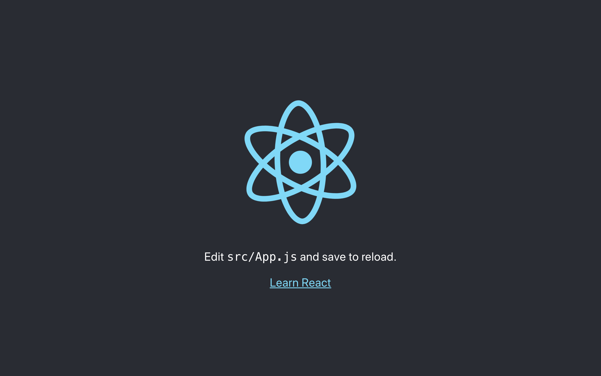
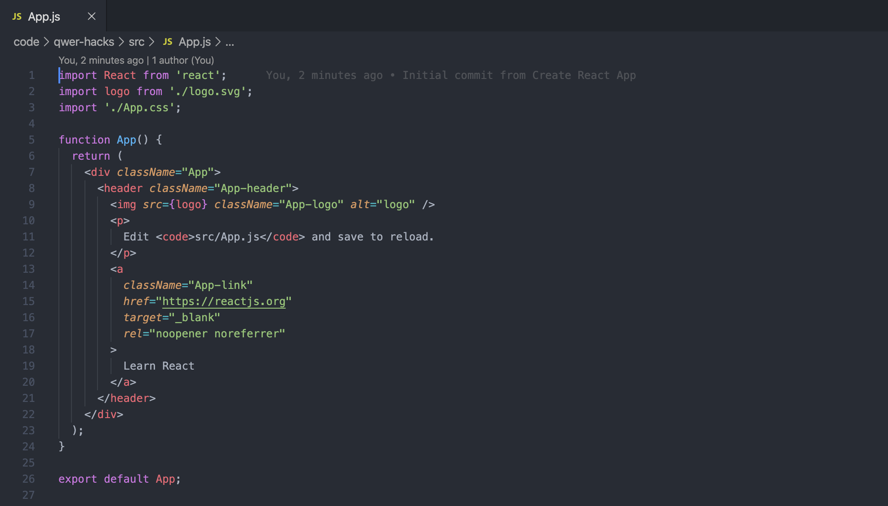
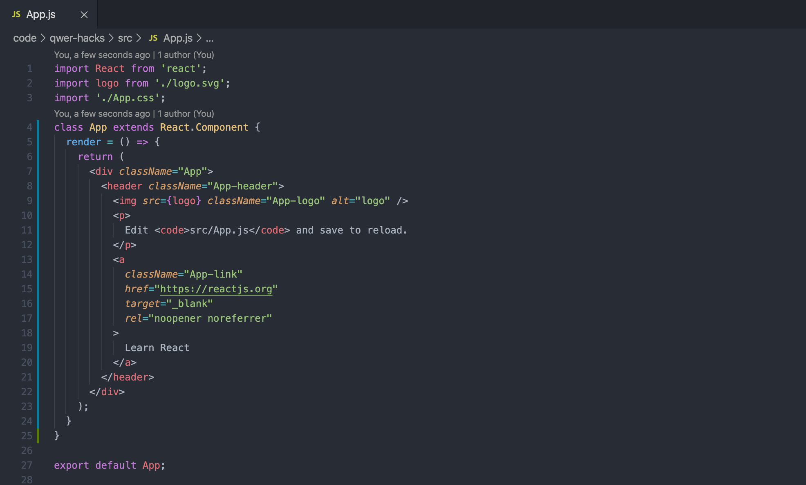

# 🌈 Intro to Web Development (with React & Firebase) Workshop (at QWER Hacks 2020)

Hey there! This repo contains the finished product of QWER Hacks 2020's Intro to Web Development (with React & Firebase) workshop, and a written guide that summarizes and expands upon the content of the workshop.

It assumes basic understanding of programming fundamentals (e.g. functions, conditionals, variables, maybe some OOP), but doesn't explicitly assume previous HTML, CSS, JS, React, or Firebase experience. However, if you don't have experience with HTML/CSS/JS, I 100% recommend that you look at some of the [appendix resources](#appendix) first, since this document/workshop brushes over the details.

You can find the slides for the workshop [here](https://docs.google.com/presentation/d/1qwiixhs7Y1T6ZBk9C_vluvLPCe3vOzkQXeTcIYtpPPw/), though this document covers (almost) everything in the slides and more!

Since this is a hackathon workshop, it goes for breadth over depth and emphasizes working familiarity rather than core understanding. Unfortunately, that menas that we gloss over a few important web development concepts; however, I've included some pointers in the Appendix on learning more. In this document, I'll occasionally footnote interesting tidbits that you can learn more about!

(this workshop was developed and presented by [matthew wang](https://matthewwang.me). if you have any questions, feel free to [ask!](mailto:matt@matthewwang.me))

## Brief Overview

The goal of this workshop is to create a skeleton for a basic web application with client-"server" interaction (I'll explain why "server" was in quotes in a moment). Specifically, the example app we'll be making is an online chatroom.

The topics we'll cover today are the bread and butter of web development, and hopefully this workshop gives you a working understanding of the basics of web development. Plus, it should give you the base set of skills to make awesome web applications at QWER Hacks!

I mentioned this earlier, but I should warn you again: this workshop is focused on quick prototyping and hackathon solutions - we’ll be skipping over a lot of the (super cool) concepts and details that can turn a mediocre developer into a superstar. I'll try to point out when we gloss over really important things, and I've also included more information in the Appendix.

## The Client-Server Model

*This touches on how web applications work on a very high level. Feel free to skip this, it's a lot of text!*

Almost all web and mobile applications follow the client-server interaction model. At a very simple level, it looks like something like this:


If you've heard of "front-end" or "back-end" web development, it usually boils down to the difference between the client and the server.

The **client**, or the front-end, is what runs on the user's computer (or other device). It's responsible for creating whatever the user sees (e.g. the interface for a web page, a mobile app, or a video game). For web applications in particular, the client is the user's web browser (like Chrome, Firefox, or Safari). Browsers themselves run code that some developer (like you!) has written, usually in HTML, CSS, and Javascript ([*](#browser-languages)). As we write some code, I'll expand a bit more on what these are; I've also included appendix entries for [HTML](#html), [CSS](#css), and [JS](#js).

Some apps can run entirely as front-end applications (meaning that after the user downloads it, the app is entirely self-contained). Examples include simple text editors or single-player video games!

However, we're doing *web* development, and that usually involves communicating over the internet somehow. Social media sites like Facebook need to store posts and images that users upload, user accounts (and their passwords!), and tons of other information that they mostly use to sell you ads.

To do this, you'll need some central computer to store and distribute this information: this is called a **server**. A lot goes into servers, but at their core they send and receive information to and from each client. The information includes the code that goes into the front-end, but also includes data that the application uses, and files that the client needs (like images, videos, or other applications). People who work on servers are often called back-end developers (though "back-end" can mean lots of things).

Servers can be written in a variety of languages; I guarantee that there's an HTTP server for your favourite language (unless it's [Brainfuck](https://en.wikipedia.org/wiki/Brainfuck)). The [appendix entry](#server-languages) covers some popular options and expands a bit more on the topic.

If you're storing lots of data (like millions or billions of users), you'll need a good way to organize, store, and retrieve your data. **Databases** are programs and rules that let developers do this efficiently. It might not sound like it, but database engineering is one of the trickiest (and highest-paying) types of web development work! Recently, there's also been an uptick in popularity of data science (and more broadly, machine learning) - there's quite a bit of cross-over with databases and data science! The [appendix entry](#databases) goes a bit more in-depth; this is a topic that we'll almost entirely gloss over in this workshop.

Hopefully, you have a better understanding of how web applications work! If stuff like this sounds cool, then you should definitely explore more of web development!

## Our Tech Stack

Okay, but what are we doing today? We're going to use two very popular libraries/frameworks to build out our front-end, and cheat a bit to do as little back-end work as possible (which is usually tougher for web development beginners).

I'll give a brief flyover of what we're using today, but we'll learn more as we delve into coding; I've also included appendix entries on both!

### React


[React](https://reactjs.org/) is a popular Javascript framework that's used to build front-ends (and more specifically, user interfaces). While you totally can make front-ends in "normal" Javascript, React can make complex apps much easier to code and manage. In particular, it allows you to create reusable code components, and manage your app state in a structured way.

React will be the core of our app: it will handle the interface of our application, keep a client-side snapshot of our data, manage our app's routing ([*](#spa)), and make calls to our back-end.

Coding "in React" is very similar to coding with Javascript, and shouldn't be too jarring if you're used to using other declarative languages or web development. It does introduce something called **JSX** ([*](#JSX)) to declare components; we'll go over that in a moment.

React is an open-source project made and maintained by Facebook. It's absurdly popular, with a vibrant and mature community, lots of supporting libraries, and jobs! I blab a bit more about React [in the appendix](#more-react).

React is one of many MVC/MV* frameworks; I talk a bit more about what that means and other examples in [the appendix](#mv-frameworks).

### Firebase


[Firebase](https://firebase.google.com) is a "comprehensive app development platform" designed to make developers' lives easier. Specifically, it implements a lot of common back-end functionalities for you (like database management, user authentication, analytics, hosting, monitoring, and testing).

Today, we'll use **Cloud Firestore**, which is a database scheme and manager provided by Firebase. It simplifies a huge (and I really mean *huge*) part of making apps. Firebase itself will manage deploying and hosting the server; we'll use Firebase's Javascript library to communicate with that server. Later on in the workshop, I'll walk you through how to set up a Firebase app.

Firebase is a product that's sold by Google, though many of its supporting libraries are open-source. It's a comparatively new product that competes in many fields of web development, but doesn't have a single competitor. I talk a bit more about Firebase [in the appendix](#more-firebase).

## Project Setup

Cool, now that we've gotten a lot of the high-level concepts out of the way, let's do some coding!

First, install [Node](https://nodejs.org) (the LTS version should be fine). I explain what Node is [in the appendix](#nodejs).

Next, open up your terminal application (Powershell on Windows, Terminal on OSX; if you're using Linux, you should know already); we're going to install our dependencies for our project.

```sh
$ npx create-react-app qwer-hacks
$ cd qwer-hacks
$ npm start
```

What did we just do?

* `npx create-react-app` is a command that creates a template application from [create-react-app](https://github.com/facebook/create-react-app), which is a project boilerplate commonly used for React apps ([*](#create-react-app)). It creates a folder (in this case, `qwer-hacks`), and installs a bunch of stuff in it!
* `cd` is the terminal command that changes the folder you're in; here, we're entering the `qwer-hacks` folder that we just made.
* `npm start` tells Node to "start" our project. More info [in the appendix](#nodejs).

After running `npm start`, you should get a message like this:

```sh
$ npm start
Compiled successfully!

You can now view qwer-hacks in the browser.

  Local:            http://localhost:3000/
  On Your Network:  http://10.0.9.62:3000/

Note that the development build is not optimized.
To create a production build, use yarn build.
```

Usually, it'll open your browser to your app; if it doesn't, visit whatever address follows "Local" in your browser (it's usually [http://localhost:3000/](http://localhost:3000/)).

You should get a screen like this:



One convenient thing is that `create-react-app` automatically refreshes your page every time you make a change to your app's code; it just makes life *that* much easier.

## React Basics: App Structure

Now, let's jump into React. The splash tells us to edit `src/App.js`, so let's do that!

Open up `src/App.js`:



And change it to this:



Here's the code, if you prefer to copy-paste it (you don't have to copy the comments, which are `//`):

```jsx
import React from 'react';
import logo from './logo.svg';
import './App.css';
class App extends React.Component { // I changed this!
  render = () => { // I changed this!
    return (
      <div className="App">
        <header className="App-header">
          
          <p>
            Edit <code>src/App.js</code> and save to reload.
          </p>
          <a
            className="App-link"
            href="https://reactjs.org"
            target="_blank"
            rel="noopener noreferrer"
          >
            Learn React
          </a>
        </header>
      </div>
    );
  } // I changed this!
}

export default App;
```

What did we just do? Well, we didn't actually change any content of the web-app (you can double-check yourself if you want)! Instead, we just reformatted (or refactored) the code to make it a bit more understandable.

But that's not helpful if we don't know what's going on! Let's break down what's happening in this file.

### React Basics: Imports

```jsx
import React from 'react';
import logo from './logo.svg';
import './App.css';
```

Here, we're importing some files and libraries from elsewhere in the app. If you've programmed in other languages, you've seen keywords like these (like `#include` in C or C++, `import` in Java or Python).

In this case, each of these three import statements is doing something slightly different:

1. `import React from 'react';` imports the React javascript library (which was stealthily installed by `npx create-react-app`). We give it a namespace of `React`, which is similar to concepts like `std::` in C++, `System.` in Java, or `math.` in Python.
2. `import logo from './logo.svg';` imports the file `logo.svg` and gives it the name `logo`. We can now use it as a variable!
3. `import './App.css';` imports the entire CSS file of `App.css`! But, you'll notice that we don't reference this in the code; this import has more to do with Webpack ([*](#webpack)). Don't worry about this for now!

Imports are a relatively new feature of Javascript, and they can be quite confusing ([*](#es6-imports)). I explain more about some of Javascript's quirks [in the appendix](#js).

### React Basics: Classes

```jsx
class App extends React.Component {
  render = () => {
    return (
      <div className="App">
        <header className="App-header">
          
          <p>
            Edit <code>src/App.js</code> and save to reload.
          </p>
          <a
            className="App-link"
            href="https://reactjs.org"
            target="_blank"
            rel="noopener noreferrer"
          >
            Learn React
          </a>
        </header>
      </div>
    );
  }
}
```

Wow, there's a lot of code here! The first line,

```jsx
class App extends React.Component {
    ...
}
```

is declaring a class called `App`; it extends (or inherits, implements, etc.) the class `React.Component`. This class will contain, you guessed it, our entire app. And, it extends `React.Component` because our entire app will be a React component!

### React Basics: Render Function

```jsx
render = () => {
    return (
      <div className="App">
        ...
      </div>
    );
}
```

All React components must have one function called a **render function** ([*](#react-render-function)). The render function must return a `JSX` element, which is what will be rendered in the app.

I'll explain JSX in just a moment, but I also want to point out what looks like weird syntax.

When people learn Javascript, they usually first learn this way to define them:

```js
function hi (message){
    console.log(message);
    return true;
}
```

This is totally valid! However, I chose to use what's called an **arrow function** ([*](#arrow-functions)).

```js
const hi = (message) => {
    console.log(message);
    return true;
}
```

This is an alternative way to write functions that has slight nuances (in our case, the relevant difference is with how `this` works). I hate being hand-wavy about how this works, but we won't have too much time to delve into this. Check out the footnote ([*](#arrow-functions)) for more.

Two quick tidbits:

In classes, the `const` can be ommitted; there's no performance difference:

```js
class Greeter {
    hi = (message) => {
        console.log(message);
        return true;
    }
}
```

If there's only one paramter, you can omit the parens. If there are no parameters, you need to have the empty parens.

```js
const hi = message => {
    console.log(message);
    return true;
}

const hello = () => {
    console.log("hello");
    return true;
}
```

### React Basics: JSX

Anyways, back to this:

```jsx
render = () => {
    return ( // must return a JSX element!
      <div className="App">
        ...
      </div>
    );
}
```

Back up a minute. What's JSX? **JSX** ([*](#jsx)) is a combination of HTML and Javascript that gives you the formatting of HTML, but allows you to use Javascript to generate content. All valid HTML is valid JSX: you see `<p>`, `<a>`, and `<div>` tags!

For example, note this line:

```jsx

```

The `{logo}` tells React to use the variable `logo`, which if you remember, is the imgae we imported at the top of the file! You can't do stuff like this in HTML, which makes JSX very powerful! The general idea is that anything in braces (`{}`) is processed as Javascript, rather than raw HTML.

A few tidbits:

If you're familiar with HTML and CSS, you'll know that you can use the `class="..."` attribute to add CSS classes to HTML elements. Unfortunately, `class` is a keyword in Javascript (we just used it earlier!), so you have to use `className="..."` instead - but the effect is the same.

Unfortunately, I don't have the time (or space) to go more in-depth in JSX, but the footnote ([*](#jsx)) has more info (and if you don't know what HTML ([*](#html)) is, check out the footnote too)! React's official documentation also has a [great page](https://reactjs.org/docs/introducing-jsx.html) that explains more.

There's an additional rule about what the render function can return; the function must return one, **and only one**, JSX element.

```jsx
// this is ok!
return (
    <div>
        ...
    </div>
);
// as is this!
return (
    <div>
        <p>
            ...
        </p>
    </div>
);
// but this isn't!
return (
    <div>
        ...
    </div>
    <div>
        ...
    </div>
);
```

One final tidbit: all we really did was change `App` from being a function to a class with a function. I'll have to be a bit hand-wavy about this now, but it turns out classes and functions are pretty similar ([*](#javascript-classes)).

### React Basics: Export

```jsx
export default App;
```

We won't really touch this line too often, but this has to do with the `import` we talked about earlier! It turns out, another file imports our `App.js` file. Like in other languages, we need to tell other programs what they can import; in this case, we'll say that the class `App` is exported. The `default` means the export isn't named by default ([*](#es6-import)).

## React Basics: Making Stuff!

Okay, now let's make some stuff change on the screen! We'll edit our `render()` function

## Appendix

### HTML

### CSS

### JS

#### this

#### arrow functions

https://developer.mozilla.org/en-US/docs/Web/JavaScript/Reference/Functions/Arrow_functions

#### Javascript Classes

#### ES6 Import

https://developer.mozilla.org/en-US/docs/Web/JavaScript/Reference/Statements/import

#### Webpack

### NodeJS

### More React

#### JSX

https://reactjs.org/docs/introducing-jsx.html

stuff on jsx

#### React Render Function

#### Create React App

https://github.com/facebook/create-react-app

### More Firebase

### Server Languages

### Databases

### MV Frameworks

## Extra Footnotes

Here are the things I've footnoted that don't fall under an appendix category.

### Browser Languages

Mention plugins (like Flash, Silverlight), web assembly, etc.

### SPA
